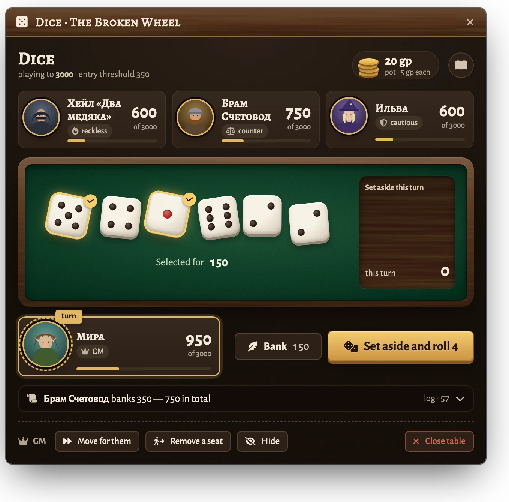
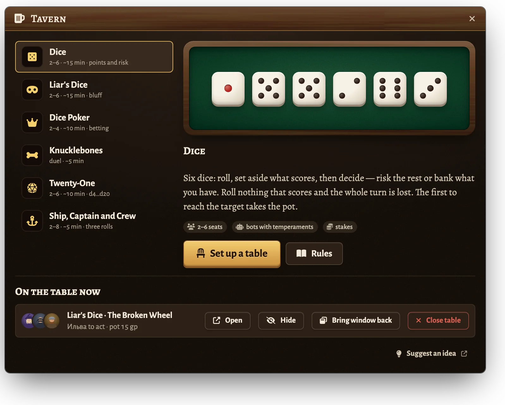
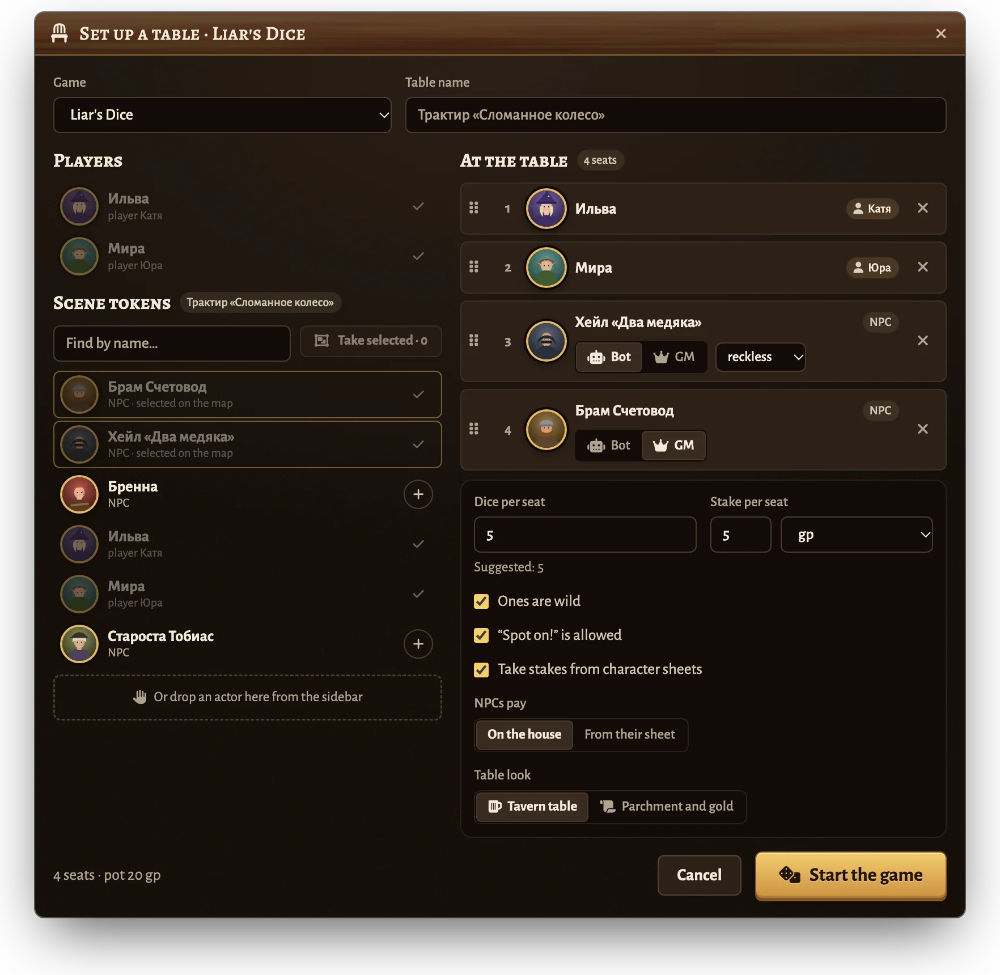
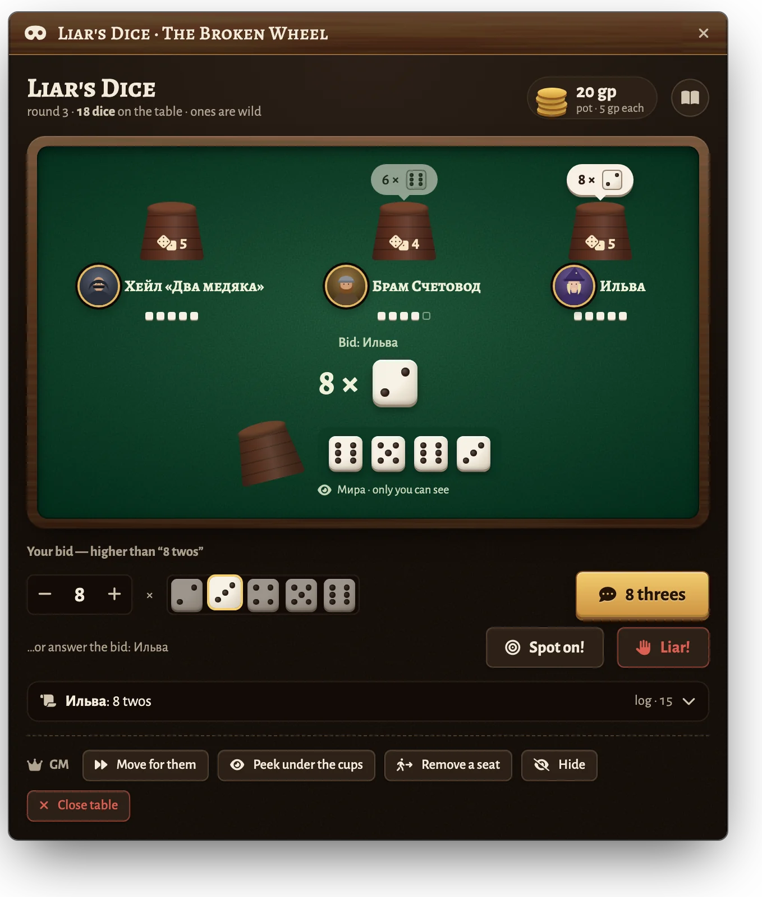
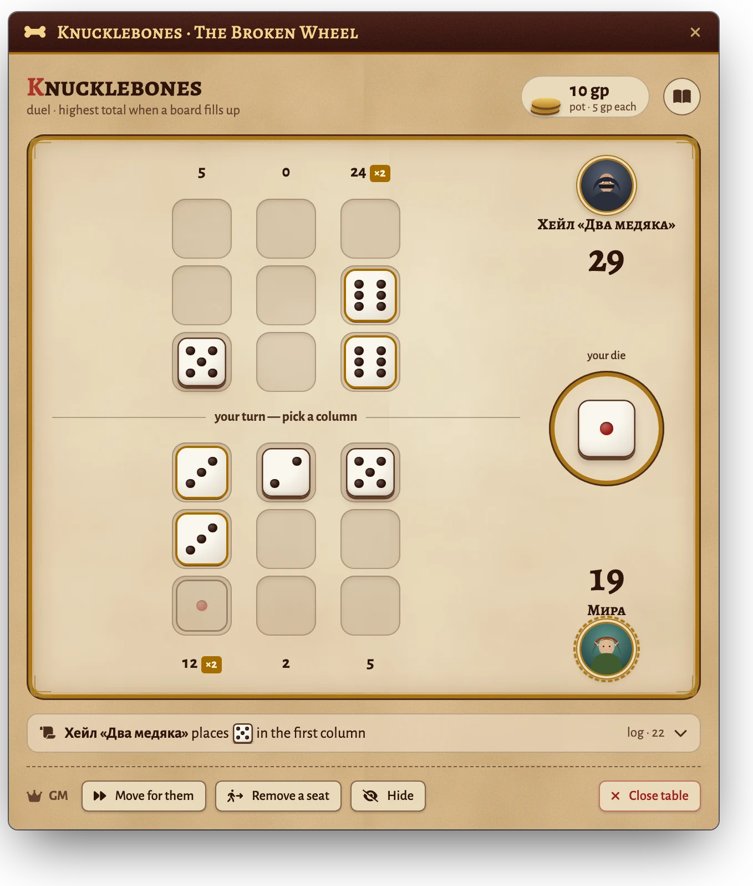
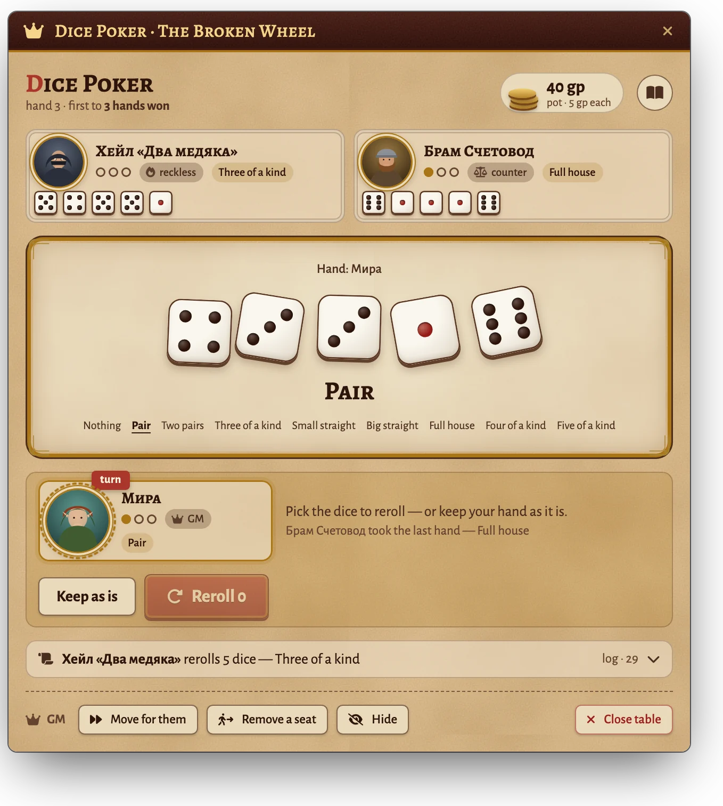
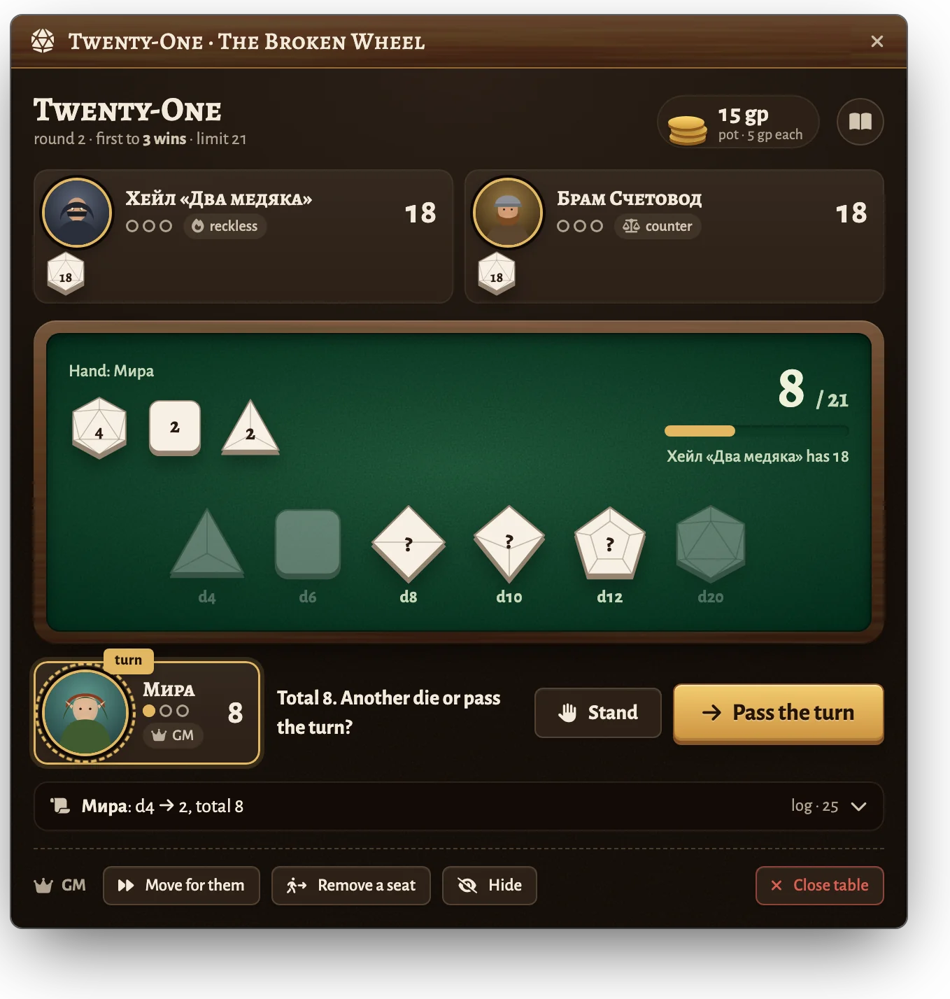
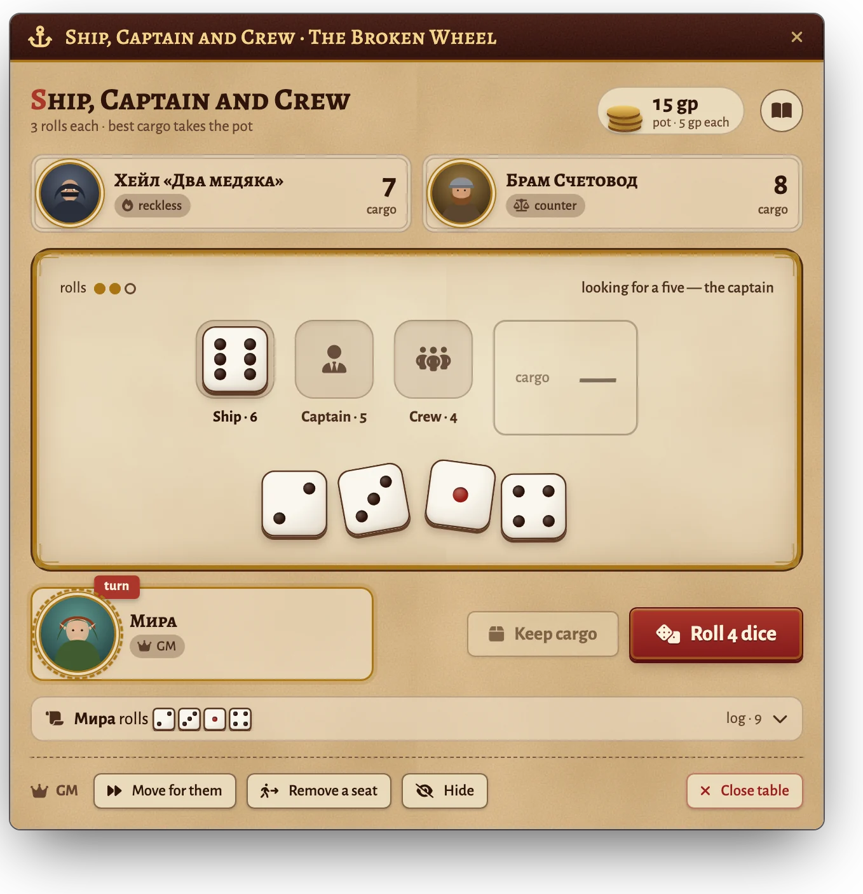
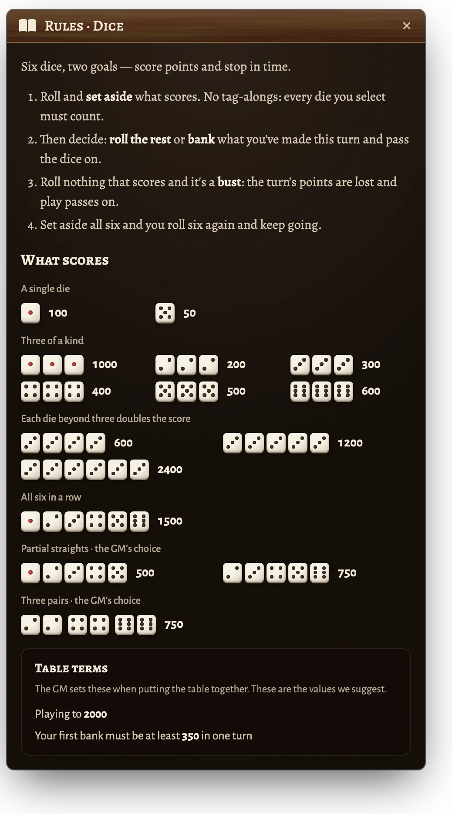

# Таверна · Tavern Games

[Русский](README.md) · **English**

Dice games for Foundry VTT that the whole table plays together. The GM seats tokens
straight from the scene, NPCs play on their own — each with a temperament — stakes come
from character sheets, and everyone sees the same table.

<p align="center">
  
</p>

## Installation

In Foundry: **Add-on Modules → Install Module**, paste the manifest URL at the bottom:

```
https://github.com/klimenkoyg/foundry-games/releases/latest/download/module.json
```

- Foundry VTT **v14** or **v13**. The module was checked on v14; it should work on v13 but hasn't been tested there yet — please report anything that's off.
- Any game system. With **dnd5e**, stakes are taken as coins from the sheets.
- Optional: [Dice So Nice](https://foundryvtt.com/packages/dice-so-nice) for 3D dice on everyone's screen.

## Games

| Game | Seats | In short |
|---|---|---|
| **Dice** (Farkle) | 2–6 | Six dice: set aside what scores, then risk the rest or bank. A bust loses the turn. |
| **Liar's Dice** | 2–6 | Everyone has a hidden cup. Bids of “N dice of face X” and “Liar!”. |
| **Dice Poker** | 2–4 | Five dice, one reroll, poker hands, betting rounds. |
| **Knucklebones** | 2 | A duel on three-by-three boards: matching dice multiply and knock out the opponent's. |
| **Twenty-One** | 2–6 | Dice from d4 to d20, each once per round. Players take turns until everyone stands. Don't go over the limit. |
| **Ship, Captain and Crew** | 2–8 | Three rolls: collect 6, 5 and 4 in order; the rest is your cargo. |

## What it looks like

<table>
  <tr>
    <td width="50%" valign="top"><br><sub><b>The Tavern</b> — the GM picks a game and sees the tables in play</sub></td>
    <td width="50%" valign="top"><br><sub><b>Setting up a table</b> — players and scene tokens, bot or GM, the stake</sub></td>
  </tr>
  <tr>
    <td width="50%" valign="top"><br><sub><b>Liar's Dice</b> — only the owner sees their dice</sub></td>
    <td width="50%" valign="top"><br><sub><b>Knucklebones</b> — the “Parchment and gold” theme</sub></td>
  </tr>
  <tr>
    <td width="50%" valign="top"><br><sub><b>Dice Poker</b> — hands, a reroll and betting</sub></td>
    <td width="50%" valign="top"><br><sub><b>Twenty-One</b> — d4 to d20, players take turns</sub></td>
  </tr>
  <tr>
    <td width="50%" valign="top"><br><sub><b>Ship, Captain and Crew</b> — find 6, 5 and 4, the rest is cargo</sub></td>
    <td width="50%" valign="top"><br><sub><b>Rules sheet</b> — every game has one; combinations are drawn as dice</sub></td>
  </tr>
</table>

## How to play

1. The GM clicks the beer-mug button in the token controls on the left to open **“Tavern”**.
2. Picks a game and clicks **“Set up a table”**.
3. Seats the participants:
   - online players — with a click;
   - scene tokens — from the list or with **“Take selected”**;
   - any token — with the **“Seat at the table”** button in its HUD (right-click the token);
   - an actor — by dragging it from the sidebar into the window.
4. For each NPC chooses **Bot** (plays by itself, by temperament) or **GM** (the GM moves for it).
5. Sets the game options, the stake and the look, then clicks **“Start the game”**.

The table window opens for everyone. A token owned by a player seats that player under the
character's name. The order of seats is the turn order; seats can be dragged.

### Stakes

Each seat's stake goes into the pot; the winner takes all of it.

- In any system these are “chips”: the module only counts the pot.
- In dnd5e with “Take stakes from character sheets”, coins are taken right away, making change
  when needed. For NPCs you choose: from their sheet or “on the house”.
- If a seat has no sheet or not enough coins, the stake is on the GM and chat says so.
- If you close a table mid-game, the module asks whether to return the stakes.

### For the GM

At the bottom of the table window: **“Move for them”** (a move for the current seat when a player
is away), **“Remove a seat”**, **“Hide”** the table from players and **“Close table”**.
In Liar's Dice there is also “Peek under the cups”.

A player who closed the window gets it back with the same token-controls button; the GM can
bring it back for everyone with “Bring window back” in the Tavern panel.

### Settings

**Settings → Configure Settings → Tavern**: table look, rolls in chat (quiet / whisper to GM /
everyone), bot pause, results to chat, animations and sound.

## Hidden dice

In Liar's Dice the dice under the cups are kept only in the GM's browser; a player receives only
their own cup. If the GM switches browsers mid-game, the table closes and stakes are returned.

## For macros

```js
const tavern = game.modules.get("ssl_tavern_games").api;
tavern.openLobby();            // GM panel
tavern.openSeating("farkle");  // seating window: farkle, liars, poker, kb, tw, scc
tavern.tables();               // tables currently in play
```

## Development

```bash
npm test          # game rules, bots, purse
npm run check     # syntax, translations, templates
npm run build     # dist/module.zip and dist/module.json
```

- `scripts/core/` — rules and bots with no Foundry dependency (covered by tests).
- `scripts/foundry/` — windows, the GM host, stakes, rolls.
- `dev/harness/` — a Foundry mock that runs the real module code in a plain browser.
- `dev/spikes.md` — checks that can only be done inside Foundry itself.
- `python3 scripts-dev/screens.py` — window screenshots for this file (`docs/screens/`), taken from the harness.

## License

You may use it and share it unmodified, free of charge; you may not modify, build upon or sell it.
Full text in [LICENSE](LICENSE). The Alegreya fonts are under the SIL Open Font License.
