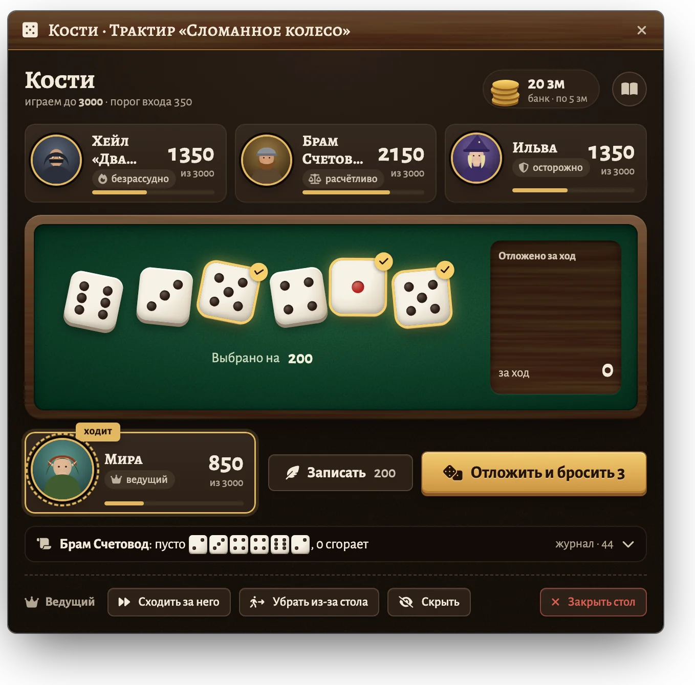
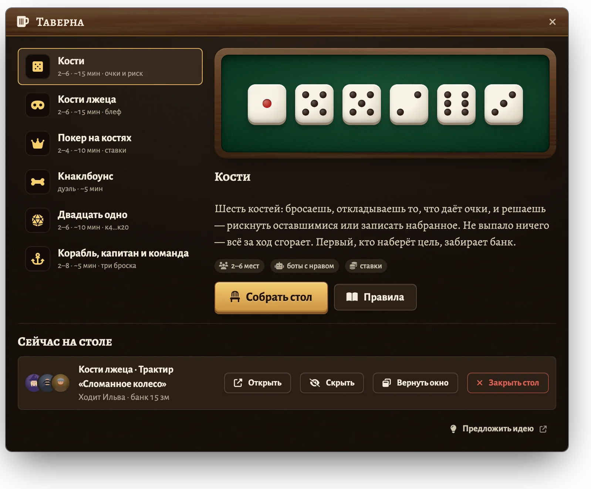
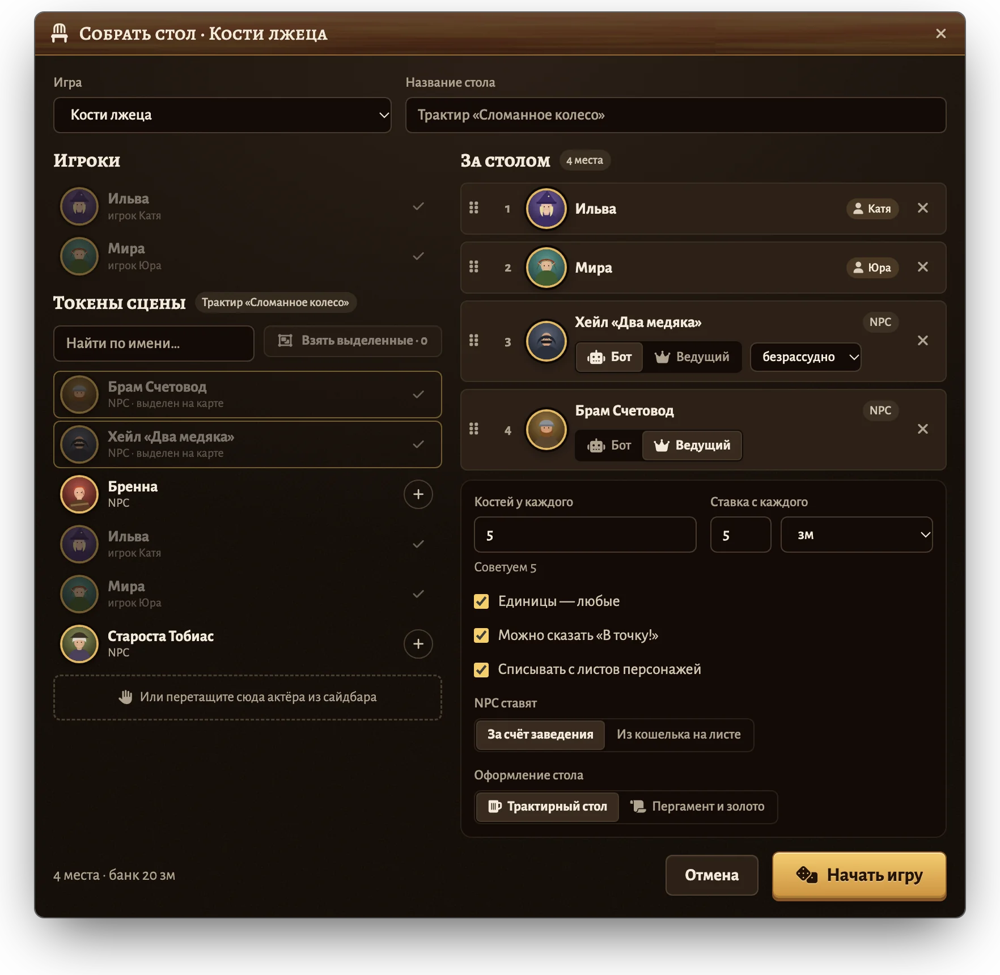
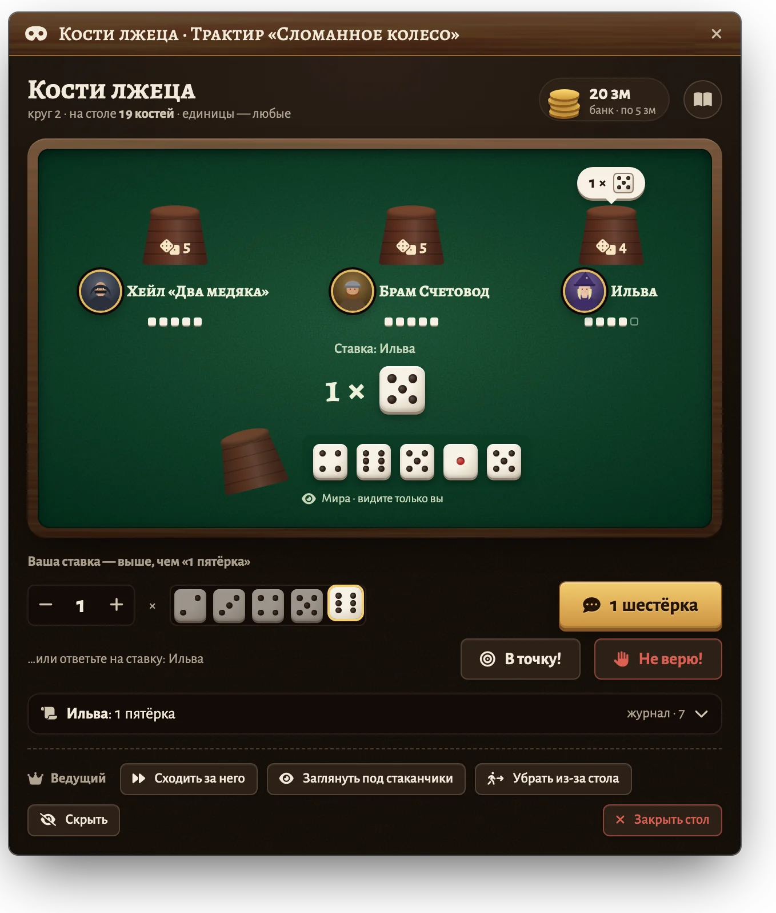
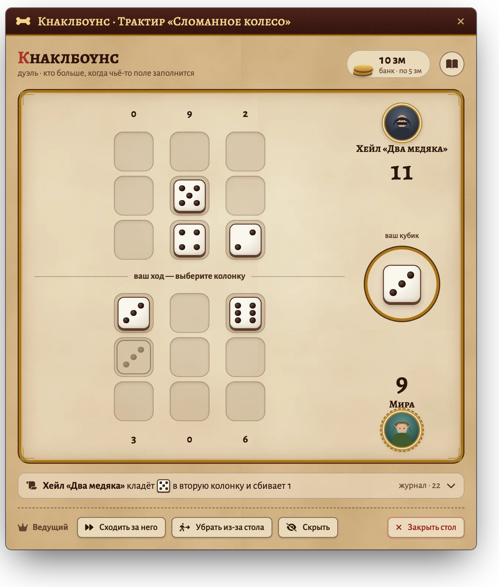
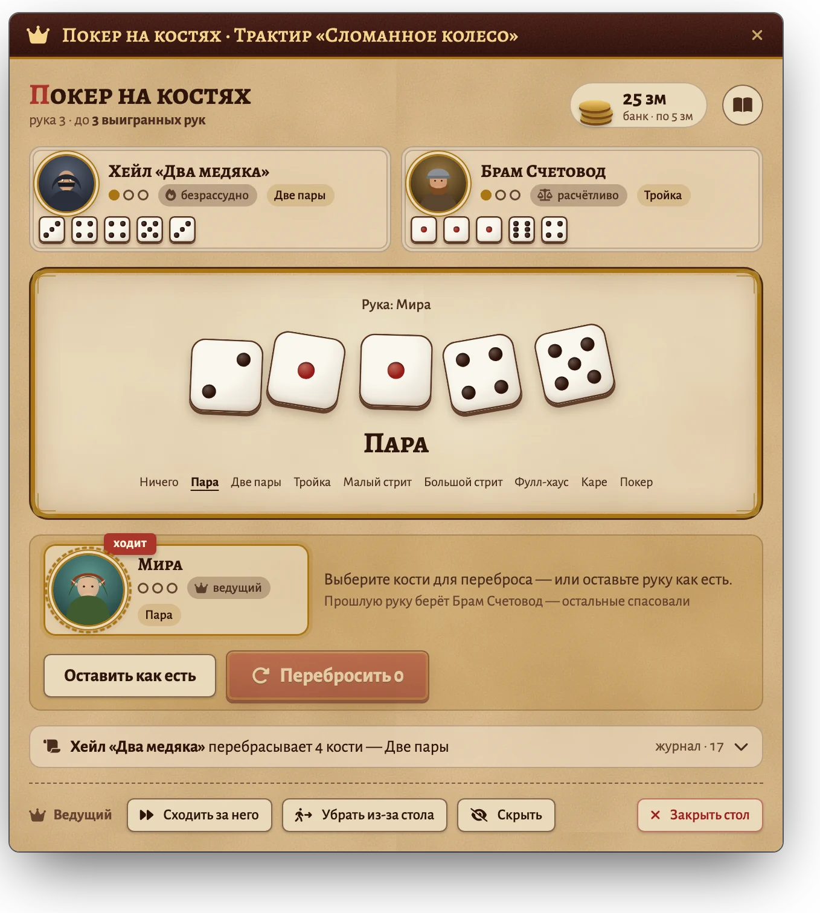
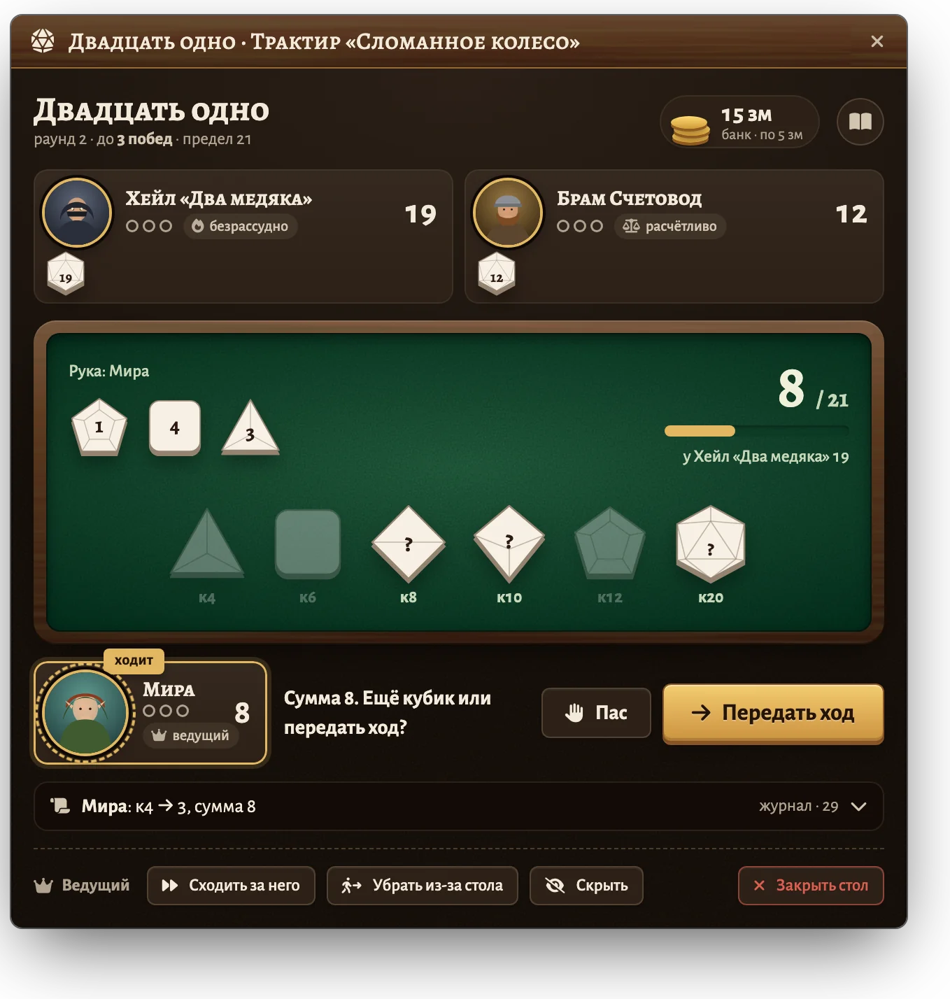
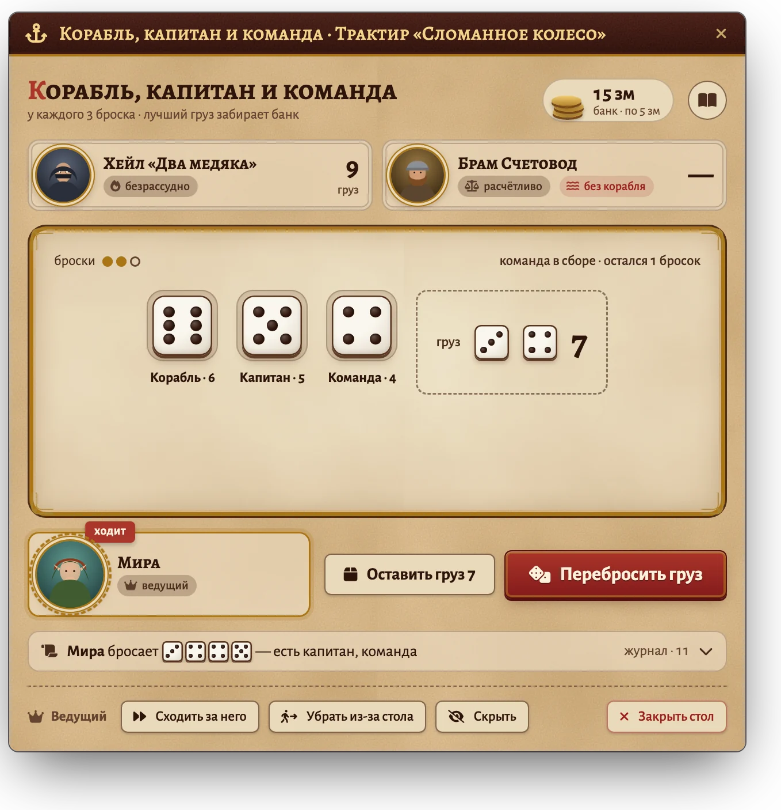
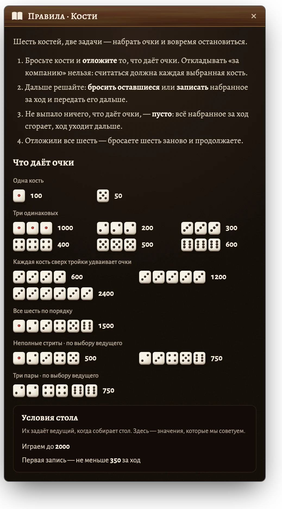

# Таверна · Tavern Games

**Русский** · [English](README.en.md)

Настольные игры на костях для Foundry VTT v14, за которые садится весь стол.
Ведущий сажает за стол токены прямо с карты, NPC играют сами — у каждого свой нрав, —
ставки идут с листов персонажей, и все видят один и тот же стол.

<p align="center">
  
</p>

## Установка

В Foundry: **Модули → Установить модуль**, внизу окна вставить адрес манифеста:

```
https://github.com/klimenkoyg/foundry-games/releases/latest/download/module.json
```

- Foundry VTT **v14**.
- Система — любая. С **dnd5e** ставки списываются монетами с листов.
- По желанию: [Dice So Nice](https://foundryvtt.com/packages/dice-so-nice) — объёмные кости у всех на экране.

## Игры

| Игра | Мест | Суть |
|---|---|---|
| **Кости** (Farkle) | 2–6 | Шесть костей: отложи очки и реши — рискнуть или записать. Пусто — ход сгорел. |
| **Кости лжеца** | 2–6 | У каждого скрытый стаканчик. Ставки «N граней X» и «Не верю!». |
| **Покер на костях** | 2–4 | Пять костей, один переброс, покерные комбинации, круги ставок. |
| **Кнаклбоунс** | 2 | Дуэль на полях три на три: одинаковые кости множатся и сбивают чужие. |
| **Двадцать одно** | 2–6 | Кубики к4…к20, каждый раз за раунд. Берут по очереди, пока все не спасуют. Не перебрать предел. |
| **Корабль, капитан и команда** | 2–8 | Три броска: собрать 6, 5 и 4 по порядку, остаток — груз. |

## Как это выглядит

<table>
  <tr>
    <td width="50%" valign="top"><br><sub><b>Таверна</b> — ведущий выбирает игру и видит идущие столы</sub></td>
    <td width="50%" valign="top"><br><sub><b>Сбор стола</b> — игроки и токены сцены, бот или ведущий, ставка</sub></td>
  </tr>
  <tr>
    <td width="50%" valign="top"><br><sub><b>Кости лжеца</b> — свои кости видит только их хозяин</sub></td>
    <td width="50%" valign="top"><br><sub><b>Кнаклбоунс</b> — тема «Пергамент и золото»</sub></td>
  </tr>
  <tr>
    <td width="50%" valign="top"><br><sub><b>Покер на костях</b> — комбинации, переброс и ставки</sub></td>
    <td width="50%" valign="top"><br><sub><b>Двадцать одно</b> — кубики к4–к20, берут по очереди</sub></td>
  </tr>
  <tr>
    <td width="50%" valign="top"><br><sub><b>Корабль, капитан и команда</b> — собрать 6, 5 и 4, остаток — груз</sub></td>
    <td width="50%" valign="top"><br><sub><b>Памятка правил</b> — есть у каждой игры, комбинации нарисованы костями</sub></td>
  </tr>
</table>

В английском интерфейсе всё то же самое — снимки есть в [README.en.md](README.en.md).

## Как играть

1. Ведущий нажимает кнопку с пивной кружкой на панели токенов слева — откроется **«Таверна»**.
2. Выбирает игру и жмёт **«Собрать стол»**.
3. Сажает участников:
   - игроков в сети — щелчком;
   - токены сцены — из списка или кнопкой **«Взять выделенные»**;
   - любой токен — кнопкой **«За стол»** в его меню (правый щелчок по токену);
   - актёра — перетащив его из сайдбара в окно.
4. У каждого NPC выбирает: **Бот** (играет сам, по нраву) или **Ведущий** (ходит ведущий).
5. Задаёт настройки игры, ставку и оформление, жмёт **«Начать игру»**.

Окно стола откроется у всех. Токен, которым владеет игрок, садит самого игрока под именем персонажа.
Порядок мест в списке — порядок ходов; места можно перетаскивать.

### Ставки

Ставка с каждого места складывается в банк, победитель забирает его целиком.

- В любой системе это «фишки»: модуль только считает банк.
- В dnd5e с галочкой «Списывать с листов» монеты снимаются с листа сразу, с разменом
  (нет золотых — возьмёт серебром). У NPC — по выбору: из кошелька на листе или «за счёт заведения».
- У кого листа нет или монет не хватает — ставка на ведущем, об этом пишется в чат.
- Если закрыть стол посреди партии, модуль спросит, вернуть ли ставки.

### Для ведущего

Внизу окна стола — полоса ведущего: **«Сходить за него»** (ход за текущее место, если игрок отошёл),
**«Убрать из-за стола»**, **«Скрыть»** стол от игроков и **«Закрыть стол»**.
В «Костях лжеца» там же — «Заглянуть под стаканчики».

Игрок, закрывший окно крестиком, вернёт его той же кнопкой на панели токенов;
ведущий может вернуть окно всем сразу — «Вернуть окно» в «Таверне».

### Настройки

**Настройки → Настройки модулей → Таверна**: оформление столов, броски в чате
(тихо / шёпотом ведущему / всем), пауза бота, итоги в чат, анимации и звук.

## Скрытые кости

В «Костях лжеца» кости под стаканчиком хранятся только в браузере ведущего; игроку приходит
лишь его собственный стаканчик. Если ведущий сменит браузер посреди партии, стол закроется
и ставки вернутся.

## Для макросов

```js
const tavern = game.modules.get("ssl_tavern_games").api;
tavern.openLobby();            // панель ведущего
tavern.openSeating("farkle");  // окно посадки: farkle, liars, poker, kb, tw, scc
tavern.tables();               // столы, которые сейчас идут
```

## Разработка

```bash
npm test          # правила игр, боты, кошелёк
npm run check     # синтаксис, переводы, шаблоны
npm run build     # dist/module.zip и dist/module.json
```

- `scripts/core/` — правила и боты без единой зависимости от Foundry (проверяются тестами).
- `scripts/foundry/` — окна, хост ведущего, ставки, броски.
- `dev/harness/` — стенд с имитацией Foundry: настоящий код модуля в обычном браузере.
- `dev/spikes.md` — проверки в самом Foundry, которые нельзя сделать без него.
- `python3 scripts-dev/screens.py` — снимки окон для этого файла (`docs/screens/`), снимаются со стенда.

## Лицензия

Пользоваться и распространять без изменений можно бесплатно; изменять, дорабатывать и продавать — нельзя.
Полный текст — в [LICENSE](LICENSE). Шрифты Alegreya — SIL Open Font License.
